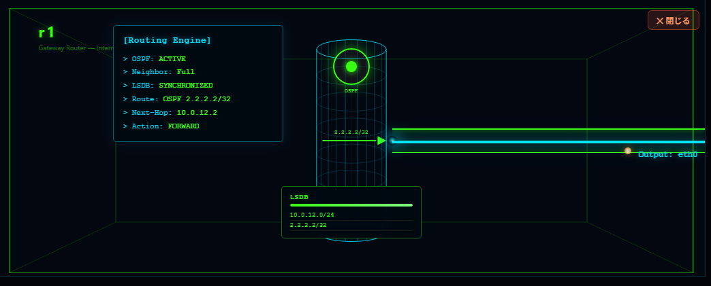

# xray-core

**See how a router actually forwards — a render engine for live router & network state.**

*English | [日本語](#日本語)*

`xray-core` turns a router's **state** (OSPF/BGP adjacency, routes, interfaces) into a live
picture: an **overview topology** and an **"inside the router" DeepDive cylinder** (forwarding
plane, OSPF/BGP processor, hello & LSDB sync, the route it installs). You drive it with a few
calls through the tidy `xrayCore` facade.

> This is the **same rendering core that powers [RouteCrushLab](https://routecrushlab.com)**,
> not a fork — extracted as a shared module so there is no drift.

It is **descriptive**, not a simulator: it draws the state your feed reports. And it is
**vendor-neutral** — every field it reads is a standard `show`-command concept, so FRRouting,
Cisco IOS, Arista, … all map onto it via a small adapter.

## Why

I learned to think about networks by drawing them. At an ISP support desk I'd take what a customer
described over the phone — what connects to what — and turn it into a topology diagram I could reason
about and ask others about. Later, while learning routing protocols myself, I drew a different kind of
diagram: what's happening *inside* a router as OSPF/BGP do their thing. Both taught me the same lesson —
a picture in your own head is worthless if the person you're talking to can't see the same one. X-Ray is
those two diagrams turned into a tool: the topology at a glance (the overview), and a look *inside* the
router at the forwarding decision (the deepdive).

## See it

**Inside the router — the DeepDive cylinder** (an OSPF adjacency at Full: hello, synced LSDB, the route it installs):



**▶ Try it live — no install:** paste a router's `show` output → it draws the topology, then click a
router to look inside. **<https://rclab-dev.github.io/xray-core/>** (or jump straight to
[paste-your-output](https://rclab-dev.github.io/xray-core/frr-paste.html)).

**▶ Or watch a real lab converge & recover** — frames captured from a running FRR/containerlab lab,
replayed in the browser with no backend (steady → link down / router isolated → re-forms → converged):
**[OSPF replay](https://rclab-dev.github.io/xray-core/demo/)** ·
**[BGP replay](https://rclab-dev.github.io/xray-core/demo/index-bgp.html)** (eBGP sessions, AS-paths, BGP table).

## Run it

Open **`index.html`** in a browser — no build, no server, no install. (Or
`python -m http.server` then `http://localhost:8000/`.)

## Quickstart

```html
<script src="xray-core.js"></script>   <!-- the engine (self-injects its CSS) -->
<script src="xray-api.js"></script>    <!-- the xrayCore facade -->
```

```js
var view = xrayCore.renderTopology('#topo', config, { topology, trace });
view.applyState(state);                                   // one snapshot
view.startPolling(() => fetch('/api/state').then(r => r.json()), 3000);  // …or live
view.openDeepDive();                                      // inside the router
```

`config` / `state` shapes are in **[DATA-CONTRACT.md](./DATA-CONTRACT.md)**.

## Examples (the gallery)

Open `index.html` for the landing, or each directly:

| Example | What it shows |
|---|---|
| **`frr-paste.html`** | Paste your own `show ip route` + `show ip ospf neighbor` → it reconstructs the topology and draws it. *Bring your own data, zero setup.* |
| **`bgp-paste.html`** | Paste your own `show bgp summary` + `show ip bgp` → it draws your eBGP neighbors, the session state, and the prefixes you learned; the cylinder shows the BGP processor + table. *Small eBGP, bring your own data.* |
| **`clab-paste.html`** | Paste a **containerlab** `.clab.yml` → it maps your lab's nodes & links to an X-Ray diagram (OSPF state, fault, DeepDive). *Small FRR labs: 2–3 nodes (link / path / triangle).* |
| **`xray-graph.html`** | A **containerlab `graph --template`** drop-in: render your *live* lab as an overview of **any size**, then click any node for its X-Ray DeepDive. *See [containerlab graph template](#containerlab-graph-template) below.* |
| **`ccna-ospf.html`** | Step the 7 OSPF neighbor states (Down→Full) without booting a router. DeepDive shows hello, LSDB sync, and the route appearing at Full. (RFC 2328 §10.1 accurate.) |
| **`bgp-session.html`** | Step the eBGP FSM (Idle→Established) between two ASes. DeepDive shows the BGP processor and the session tunnel; at Established it learns `203.0.113.0/24`. (RFC 4271 §8.) |
| **`noc-live.html`** | Wire `startPolling()` to telemetry; the view updates itself in real time. |
| **`failover.html`** | A redundant OSPF triangle: cut the shortest path → detour, cut the backup → isolation. |

## containerlab graph template

Already running a **[containerlab](https://containerlab.dev)** lab? `xray-graph.html` is a drop-in for
`containerlab graph --template`. It renders your live topology as an overview of **any size** (the
overview layout is commodity — it doesn't try to out-draw NeXt UI), and then **clicking any node opens
that node's X-Ray DeepDive**: OSPF/BGP adjacencies, the LSDB (every prefix the node learned — its own
networks and the remote loopbacks, own vs learned), and the route it installs. Nodes with 3+ neighbors
get a peer-pair selector (the cylinder shows one adjacency pair at a time).

```
containerlab graph \
  --topo lab.clab.yml \
  --template xray-graph.html \
  --static-dir <this gallery dir>   # serves xray-core.js, xray-api.js, clab-xray-bridge.js
```

Clone this repo and point `--static-dir` at it. The overview comes from clab's own
`{{ .Name }}` / `{{ .Data }}` injection (nodes + links), so node/link count is unbounded — X-Ray adds
the per-node DeepDive on top.

**Live state (optional):** `clab-collect.js` is a small Node tool that reads ONE node's real FRR
state from a running lab (`docker exec clab-<lab>-<node> vtysh -c "show … json"`) and emits a `state`
object you feed straight to the DeepDive — so the cylinder shows the *actual* OSPF/BGP adjacency,
LSDB and installed route, not a synthesized one:

```
node clab-collect.js --lab <lab> --node <node> --adj eth0:peerA,eth1:peerB > state.json
# then in the browser:  view.openDeepDiveFor('<node>', state)   // state loaded from state.json
```

It maps each neighbor to its clab peer by interface (so it works on any IP plan), and supports
OSPF and BGP. The collector is live-verified end-to-end against a real containerlab FRR 8.4 lab
(0 field mismatches, live state drives the DeepDive); only FRR 8.4 is live-verified so far, so if
your FRR version's `… json` keys differ, collect the json yourself and pass `--fixtures <dir>`,
and please open an issue with the raw output. *(Without the collector, the template renders a synthesized state — correct topology,
assumed-healthy adjacencies.)*

**Auto-wire the whole graph (optional):** `clab-xray-collect.js` does the above for *every* node in
one step — it derives each node's adjacency from the topology links, runs `clab-collect.js` per node,
and writes `xray-states.js` (`window.LIVE_STATES`) next to the assets. `xray-graph.html` loads it
automatically when present, so every node's DeepDive shows its **real** state; if it's absent the graph
falls back to the synthetic scaffold (so this step is purely additive):

```
node clab-xray-collect.js lab.clab.yml <this gallery dir>     # writes <dir>/xray-states.js
containerlab graph --topo lab.clab.yml --template xray-graph.html --static-dir <this gallery dir>
```

**Live mode (optional):** add `--watch` and the collector keeps re-collecting on an interval, only
rewriting `xray-states.js` when something actually changed. It also sets `window.LIVE_WATCH`, which
tells the graph to poll for updates and refresh the **open node in place** (`applyState`, no flicker —
it redraws only when the state moves). Without `--watch` the snapshot is static and the graph never
polls, so this is purely opt-in:

```
node clab-xray-collect.js lab.clab.yml <this gallery dir> --watch --interval 3 &
containerlab graph --topo lab.clab.yml --template xray-graph.html --static-dir <this gallery dir>
# shut a link in the lab → the open node's DeepDive updates within a few seconds.
```

## What people build with it

- **Interactive teaching modules** — embed an OSPF/BGP walkthrough in a blog post or course.
- **Live NOC / lab dashboards** — point `startPolling()` at your telemetry (Containerlab, FRR, EVE-NG).
- **Paste-to-visualize** — drop CLI output in the browser to reconstruct a topology, no setup.
- **Postmortem & MOP figures** — render before/after state to show what rerouted, for a writeup.

(You bring the data; the engine draws it.)

## Bring your own network

Two ways to feed it:

1. **Paste (fastest)** — open `frr-paste.html` and paste a router's `show ip route` +
   `show ip ospf neighbor`. **It runs entirely in your browser — your config is never uploaded.**
   Scope today: **FRR, OSPF, small topologies**. BGP, large meshes, and other vendors aren't
   auto-parsed yet.
2. **Feed `state` directly (any vendor)** — build the documented `config`/`state` objects and call
   `view.applyState(state)`. This is how you support **Cisco IOS / Arista / Juniper**: write a small
   adapter from your OS's `show` output to the shapes in
   **[DATA-CONTRACT.md](./DATA-CONTRACT.md)** (which includes a FRR ↔ Cisco IOS `show`-command
   mapping table and the two optional seams). **`frr-parse.js` is the worked adapter template** —
   copy it and swap the regexes for your vendor.

To embed in your own page, copy this folder and replace `data.js` (the worked reference example).
The live ping/packet animation is hidden in these demos (it is traffic-specific, driven by the
optional trace seam); the engine fully supports it — see DATA-CONTRACT §Seam B.

## Theming

`xrayCore.applyTheme('troubleshoot' | 'capture' | 'destroy')` switches the three built-in palettes.
The engine ships its own CSS (self-injected) — it is not a fully CSS-variable-themeable widget yet;
treat the three themes as the supported looks.

## Install / integrate

Today this is **drop-in for the browser**: include the two `<script>` tags (above) and use the
`window.xrayCore` global. There is **no npm package, ES module, or TypeScript types yet** — it is
embedding-first (blog posts, dashboards, internal tools), not a bundler dependency. If you need
ESM/types, fork and wrap it.

## Scope & maintenance

- **Descriptive renderer, not a network simulator** — it draws the state you feed it; it does
  not compute routes or run protocols.
- **Vendor-neutral via adapter** — map your router OS's `show` output to the documented shapes
  (`frr-parse.js` is the template; DATA-CONTRACT has the mapping).
- **Browser-only / private** — the paste demo sends nothing to a server.
- **Maintained minimally / single maintainer.** Issues are read but carry no SLA, and
  **pull requests are not accepted** (a single copyright holder is kept so the project can be
  relicensed later). **Forking is welcome** under the license below.

## License

[MIT](./LICENSE) — Copyright (c) 2026 RouteCrushLab (@routecrushlab).

---

# 日本語

*[English](#xray-core) | 日本語*

**ルータが実際にどう転送しているかを見る — ルータ／ネットワークの状態を描く render エンジン。**

`xray-core` は、ルータの**状態**(OSPF/BGP の隣接・経路・インターフェース)を生きた絵にします:
**全体トポロジ**と、**「ルータの中」を見る DeepDive 円柱**(転送プレーン、OSPF/BGP プロセッサ、
hello と LSDB 同期、実際にインストールされる経路)。操作は `xrayCore` ファサード越しの数行だけ。

> これは **[RouteCrushLab](https://routecrushlab.com) を動かしているのと同じ描画コア**で、
> フォークではありません — 共有モジュールとして切り出し、本体とドリフトしない構成です。

**シミュレータではなく記述的(descriptive)**:与えた状態を描くだけで、経路計算もプロトコル実行も
しません。また**ベンダー中立**で、読み取る項目はすべて標準的な `show` コマンドの概念なので、
FRRouting・Cisco IOS・Arista … いずれも小さなアダプタで対応できます。

## なぜ

私はネットワークを「絵を描く」ことで考えるようになりました。ISP のサポート窓口で、お客さんが電話越しに
話す構成 ——何が何につながっているか—— を、自分で考えて人に相談できる一枚のトポロジ図に起こす。のちに
自分でルーティングプロトコルを学ぶときには、別の種類の図を描いていました:OSPF/BGP が動くとき、ルータの
**「中」で何が起きているか**の図です。どちらも同じことを教えてくれました ——**自分の頭の中に絵があっても、
話す相手に同じ絵が浮かばなければ意味がない**。X-Ray はこの2つの図を道具にしたものです:全体を一目で見る
**Overview** と、ルータの中の転送判断を覗く **DeepDive**。

## 見る

上の静止画は **DeepDive 円柱**(OSPF 隣接が Full:hello・LSDB 同期・学習した経路)。
**▶ ライブで試す(インストール不要)**:ルータの `show` 出力を貼る → トポロジが描かれ、ルータをクリックすると
中が見える — **<https://rclab-dev.github.io/xray-core/>**(貼って試すなら
[frr-paste.html](https://rclab-dev.github.io/xray-core/frr-paste.html))。

## 動かす

ブラウザで **`index.html`** を開くだけ — ビルド・サーバ・インストール不要
(または `python -m http.server` → `http://localhost:8000/`)。

## クイックスタート

```html
<script src="xray-core.js"></script>   <!-- エンジン本体(CSS を自己注入) -->
<script src="xray-api.js"></script>    <!-- xrayCore ファサード -->
```

```js
var view = xrayCore.renderTopology('#topo', config, { topology, trace });
view.applyState(state);                                   // スナップショット1枚
view.startPolling(() => fetch('/api/state').then(r => r.json()), 3000);  // …またはライブ
view.openDeepDive();                                      // ルータの中へ
```

`config` / `state` の形は **[DATA-CONTRACT.md](./DATA-CONTRACT.md)** にあります。

## 例(ギャラリー)

`index.html` でランディング、または各ファイルを直接開く:

| 例 | 何を見せるか |
|---|---|
| **`frr-paste.html`** | 自分の `show ip route` + `show ip ospf neighbor` を貼る → トポロジを再構築して描画。*データ持ち込み・セットアップ不要。* |
| **`bgp-paste.html`** | 自分の `show bgp summary` + `show ip bgp` を貼る → eBGP 隣接・セッション状態・学習プレフィックスを描画。円柱で BGP プロセッサ + テーブルを表示。*小規模 eBGP・データ持ち込み。* |
| **`clab-paste.html`** | **containerlab** の `.clab.yml` を貼る → ラボのノード/リンクを X-Ray 図にマップ(OSPF 状態・障害・DeepDive)。*小規模 FRR ラボ: 2〜3 ノード(link / path / triangle)。* |
| **`xray-graph.html`** | **containerlab `graph --template`** の drop-in:稼働中ラボを**任意サイズ**の overview で描き、ノードをクリックでそのノードの X-Ray DeepDive。*下記 [containerlab graph テンプレート](#containerlab-graph-テンプレート) 参照。* |
| **`ccna-ospf.html`** | OSPF の7状態(Down→Full)をルータを起動せずに1歩ずつ。DeepDive で hello・LSDB 同期・Full での経路出現を表示(RFC 2328 §10.1 準拠)。 |
| **`bgp-session.html`** | eBGP の FSM(Idle→Established)を2つの AS 間で1歩ずつ。DeepDive で BGP プロセッサとセッショントンネルを表示し、Established で `203.0.113.0/24` を学習(RFC 4271 §8)。 |
| **`noc-live.html`** | `startPolling()` をテレメトリに繋ぐと、ビューが自分でリアルタイム更新。 |
| **`failover.html`** | 冗長 OSPF 三角形:最短路を切る→迂回、バックアップも切る→孤立。 |

## containerlab graph テンプレート

すでに **[containerlab](https://containerlab.dev)** でラボを動かしているなら、`xray-graph.html` が
`containerlab graph --template` の drop-in です。稼働中トポロジを**任意サイズ**の overview で描き
(overview レイアウトは commodity — NeXt UI と描画品質を競わない)、**ノードをクリックするとその
ノードの X-Ray DeepDive** が開きます:OSPF/BGP 隣接・LSDB・インストールされる経路。隣接3+のノードは
peer-pair セレクタが出ます(円柱は隣接1対ずつ表示)。

```
containerlab graph \
  --topo lab.clab.yml \
  --template xray-graph.html \
  --static-dir <この gallery ディレクトリ>   # xray-core.js / xray-api.js / clab-xray-bridge.js を serve
```

このリポジトリを clone して `--static-dir` をそこへ向けるだけ。overview は clab 自身の
`{{ .Name }}` / `{{ .Data }}`(nodes + links)注入から作るのでノード/リンク数は無制限 — X-Ray は
その上に per-node DeepDive を足します。

**live state(任意):** `clab-collect.js` は、稼働中ラボの1ノードの実 FRR 状態を読み
(`docker exec clab-<lab>-<node> vtysh -c "show … json"`)、DeepDive にそのまま渡せる `state` を出す
小さな Node ツールです。円柱に「実際の」OSPF/BGP 隣接・LSDB・インストール経路が出ます(合成でなく):

```
node clab-collect.js --lab <lab> --node <node> --adj eth0:peerA,eth1:peerB > state.json
# ブラウザ側:  view.openDeepDiveFor('<node>', state)   // state.json を読み込んで渡す
```

neighbor を interface で clab ピアにマップする(任意 IP プランで動く)・OSPF/BGP 対応。collector は
実 containerlab FRR 8.4 ラボに対し live で end-to-end 検証済(field mismatch 0・live state が
DeepDive を駆動)。live 検証済は今のところ FRR 8.4 のみ。FRR バージョンで `… json` のキーが違う
場合は自分で json を集め `--fixtures <dir>` で渡し、raw 出力を issue で報告ください。*(collector 無しでもテンプレは合成 state で
描画します — トポロジは正しく、隣接は健全と仮定。)*

## 何に使えるか

- **インタラクティブ教材** — OSPF/BGP の解説をブログ記事や講座に埋め込む。
- **ライブ NOC / ラボ ダッシュボード** — `startPolling()` を自分のテレメトリ(Containerlab・FRR・EVE-NG)へ。
- **貼って可視化** — CLI 出力をブラウザに貼るだけでトポロジを再構築、セットアップ不要。
- **ポストモーテム・MOP 図** — 障害前後の状態を描いて「何が迂回したか」を報告書に。

(データはあなたが用意、描くのはエンジン。)

## 自分のネットワークを入れる

2つの方法:

1. **貼る(最速)** — `frr-paste.html` を開いて `show ip route` + `show ip ospf neighbor` を貼る。
   **すべてブラウザ内で動き、config はアップロードされません。** 現在の対応範囲:
   **FRR・OSPF・小規模トポロジ**。BGP・大規模メッシュ・他ベンダーはまだ自動解析しません。
2. **`state` を直接渡す(任意ベンダー)** — ドキュメント化された `config`/`state` を作って
   `view.applyState(state)` を呼ぶ。**Cisco IOS / Arista / Juniper** はこの方法:自分の OS の
   `show` 出力を **[DATA-CONTRACT.md](./DATA-CONTRACT.md)** の形(FRR ↔ Cisco IOS の `show`
   コマンド対応表と、2つの任意シーム付き)に変換する小さなアダプタを書く。
   **`frr-parse.js` がそのアダプタの雛形**なので、コピーして正規表現を自分のベンダー用に差し替える。

自分のページに埋め込むには、このフォルダをコピーして `data.js`(動く参照例)を差し替える。
ping/パケットのアニメはこれらのデモでは非表示(通信内容依存・任意の trace シーム駆動)ですが、
エンジン自体は対応しています — DATA-CONTRACT §Seam B を参照。

## テーマ

`xrayCore.applyTheme('troubleshoot' | 'capture' | 'destroy')` で3つの組み込みパレットを切替。
エンジンは自前の CSS を持つ(自己注入)ため、任意の CSS 変数で自由にテーマ化できるウィジェットでは
まだありません。**この3テーマが対応する見た目**と捉えてください。

## 導入 / 組み込み

現状は**ブラウザにそのまま入れる**形:上の `<script>` を2つ読み込み `window.xrayCore` を使う。
**npm パッケージ・ES Module・TypeScript 型はまだありません** — バンドラ依存ではなく埋め込み第一
(ブログ記事・ダッシュボード・社内ツール)。ESM/型が必要ならフォークして包んでください。

## スコープと保守

- **記述レンダラであってシミュレータではない** — 与えた状態を描くだけ。経路計算もプロトコル実行もしない。
- **アダプタでベンダー中立** — 自分のルータ OS の `show` 出力をドキュメントの形に対応付ける
  (`frr-parse.js` が雛形、DATA-CONTRACT に対応表)。
- **ブラウザ完結・プライベート** — 貼るデモはサーバへ何も送らない。
- **最小限の保守・単独メンテナ。** Issue は読みますが SLA はなく、**Pull Request は受け付けません**
  (将来の再ライセンスのため著作権者を単一に保つ方針)。**フォークは歓迎**します(下記ライセンス)。

## ライセンス

[MIT](./LICENSE) — Copyright (c) 2026 RouteCrushLab (@routecrushlab)。
